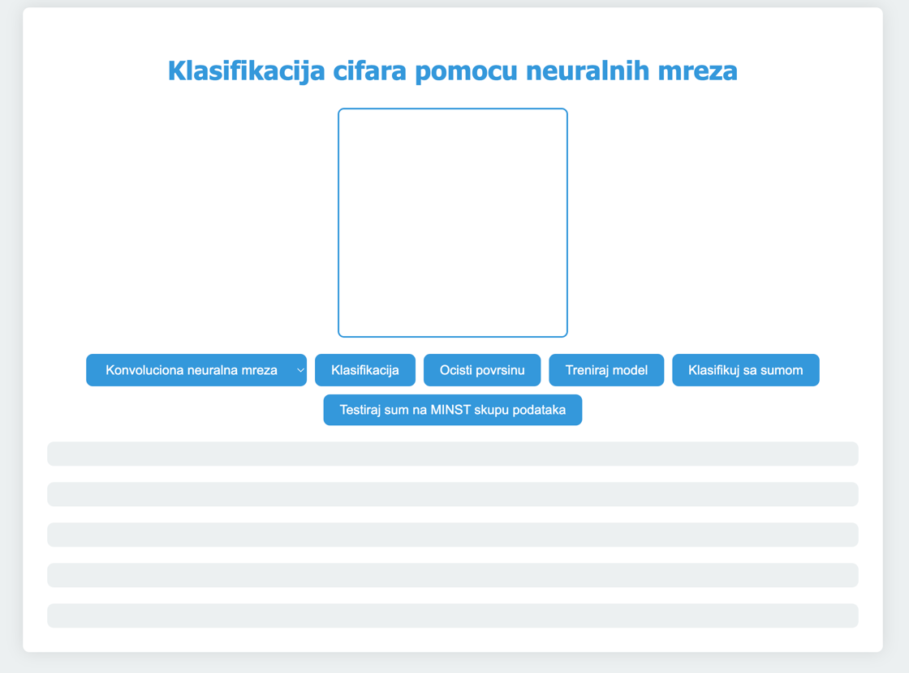
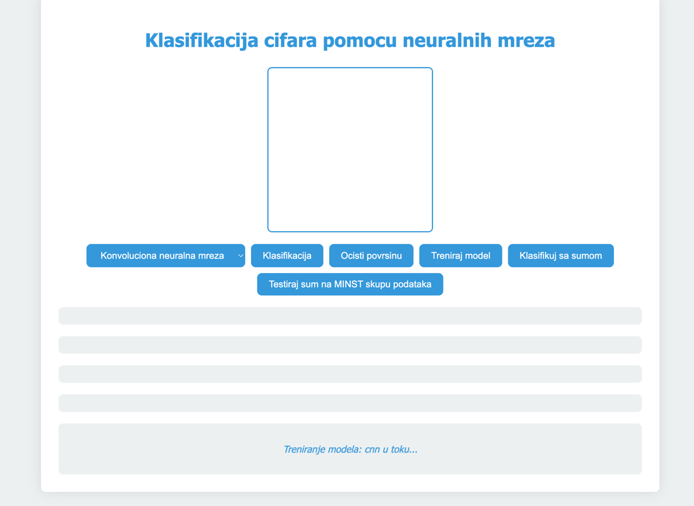
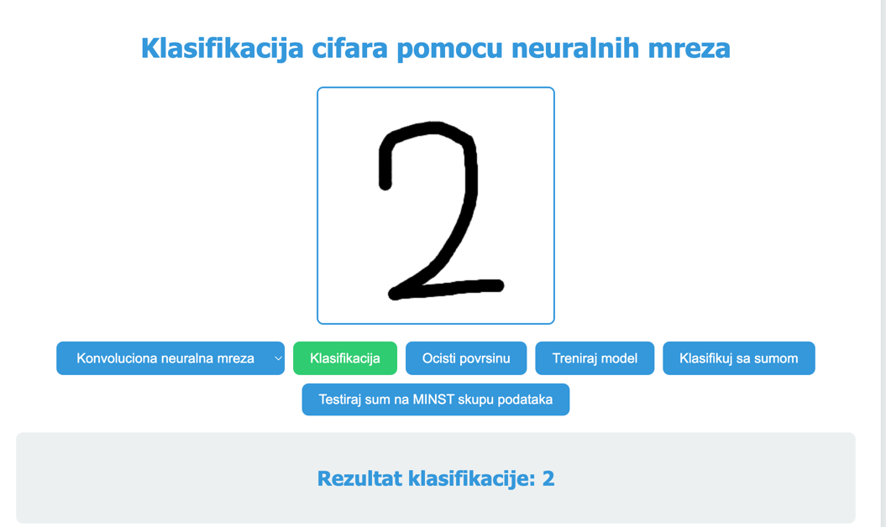
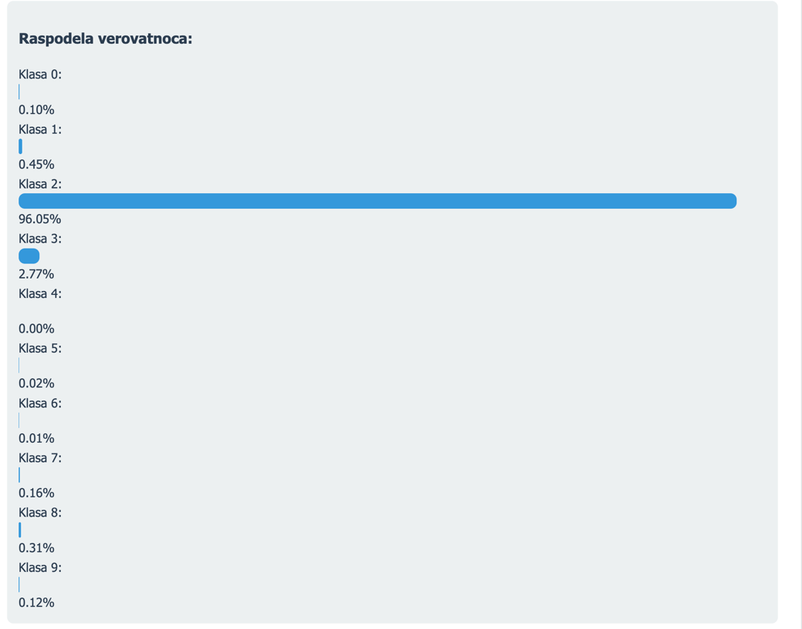
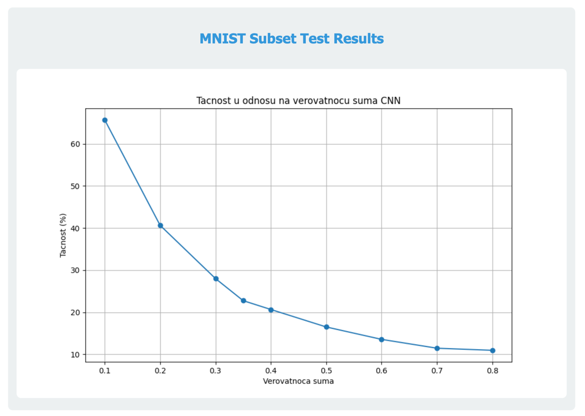
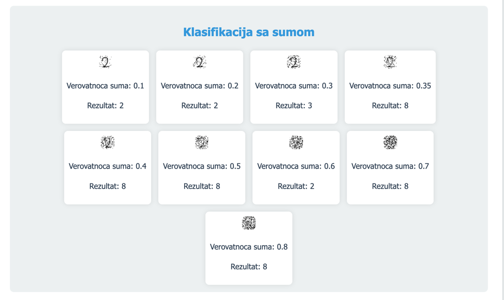
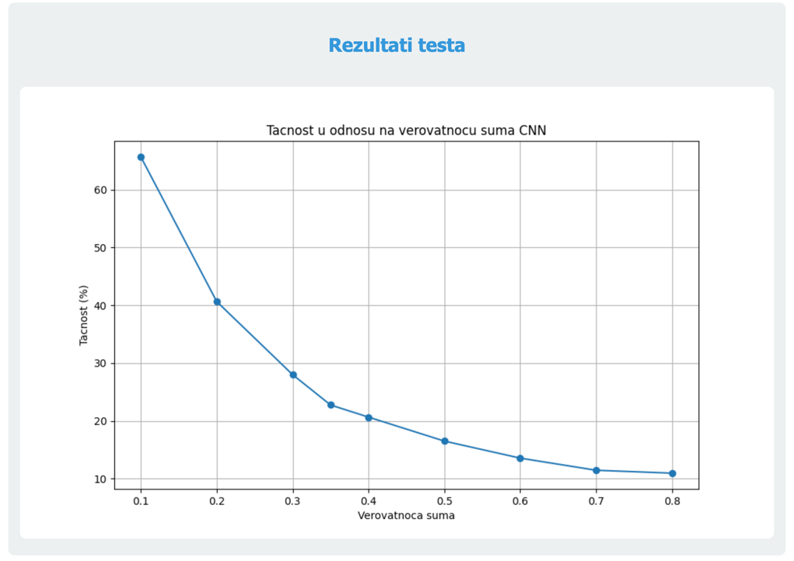
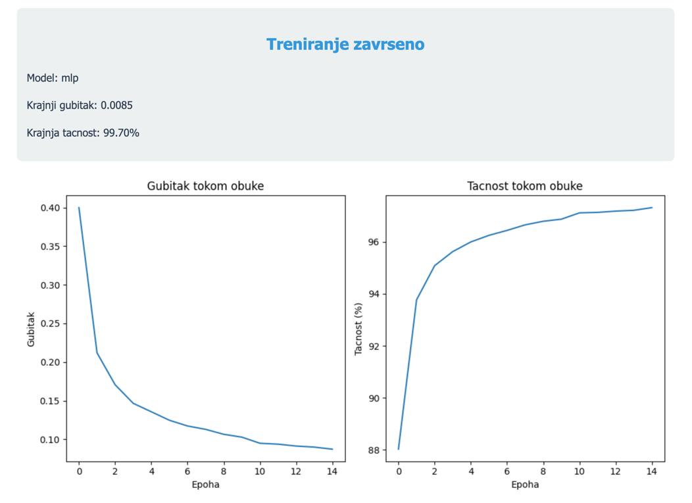

# Digit classifier project

This project is a digit classifier using the MNIST dataset. The dataset is a collection of 28x28 pixel images of handwritten digits from 0 to 9. The goal of this project is to train a model that can classify these images into the correct digit.
It has a frontend which allows for model training, adding noise and checking for impact of noise on classification accuracy.

This is the basic layout of my application.

Training in progress

The model is being trained in 15 epochs

This is how the finished training process looks like

This is how classification looks like

And these are probabilities that show how confident the model is in its classification

This is the noise vs probability plot

This is the noisy detection with classification results

